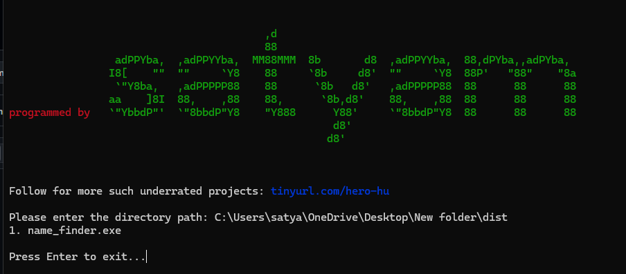

# 🚀 FileSentry - v1.0 (without gui)
_A simple and efficient command-line file explorer._  

   

---

## 📌 Features  
✅ **Lists all files in a directory** 📂  
✅ **Automatically excludes itself from the list** 🚫  
✅ **Works in Windows CMD, PowerShell, and Linux terminals** 💻  
✅ **Uses color-coded output for better visibility** 🎨  
✅ **Lightweight, no external dependencies required** ⚡  

---

## 📜 How It Works  
This app scans a user-specified directory and lists **all files** inside it, excluding itself.  

---

## 🔧 Installation  
1. **Clone the Repository**  
   ```sh
   git clone https://github.com/yourusername/FileSentry.git
   cd FileSentry

2. **Run the App**
    ```sh
   python name_finder.py

# Project Title

This project demonstrates the functionality of the app. Here's a screenshot of the app in action:




# Creator Information

📌 **Creator:** Satyam    
🌐 **Website:** [SOCIALS](https://tinyurl.com/hero-hu)

# 📝 License
This project is licensed under the MIT License.

